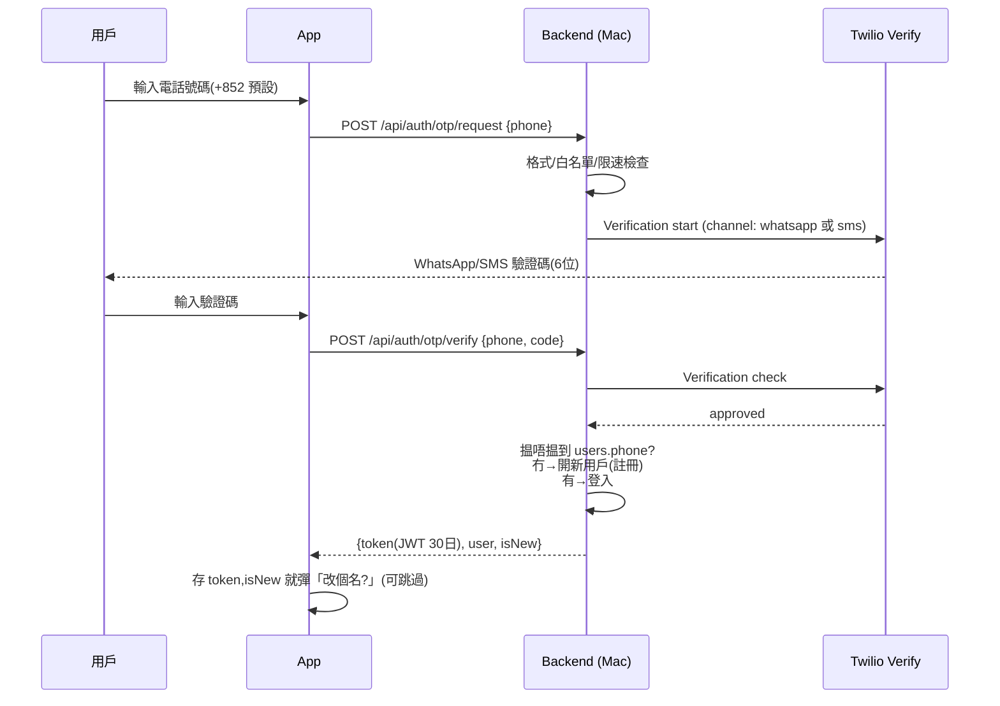

# 電話號碼 + 驗證碼登入方案(SMS / WhatsApp)

> 設計文件,交執行 session(Sonnet)實作;實作前要 Eric 拍板揀通道 + 開帳戶。
> 2026-07-20 v2:Eric 確認大陸用戶行 email 後備通道(§0/§4 維持原案);
> 香港號碼想研究 **WhatsApp 發驗證碼** —— 新增 §1A 比較,俾 Eric 揀。
> 而家嘅系統:username/email/password(backend/routes/auth.js,JWT 30日,bcrypt),
> 前端 AuthScreen/LoginScreen + AuthContext。

## 0. 先講一個潑冷水嘅事實:大陸 +86 號碼基本上做唔到

2025 年 4 月起中國三大運營商收緊 A2P 短訊,**2025 年 12 月 5 日起未喺內地完成品牌註冊嘅
國際發送方一律封殺**。而註冊資格:要有**中國內地實體 + 營業執照**,香港公司/香港實體
**明文唔合資格**。即係話:

- Twilio / Firebase / Vonage 呢啲國際服務,發去 +86 嘅 OTP 而家失敗率極高,年底後直情發唔到。
- 騰訊雲/阿里雲國內短訊要實名 + 簽名報備 + 模板審核,一樣要內地主體。
- 微信登入(替代方案)嘅開放平台登入權限都要企業主體認證。

**結論:除非 Eric 有內地公司,大陸用戶條路唔係 SMS。**建議:
- SMS OTP 只開放 **+852**(將來可以加台灣/海外白名單);
- +86 用戶入到嚟就顯示友善提示,俾佢用 **Email 驗證碼登入**(下面 §4,成本零,實作同一套 OTP 邏輯)。

呢個限制要 Eric 知情先好開工。

## 1. 服務商比較(2026-07 查證)

| | Twilio Verify | Firebase Phone Auth | 騰訊雲/阿里雲 SMS |
|---|---|---|---|
| 收費(香港號碼) | US$0.05/次成功驗證 + SMS 費 ~US$0.072/條 ≈ **每次登入 ~US$0.13** | 按條計,約 US$0.01-0.06/條(地區浮動),要開 Blaze(綁卡) | 最平(~¥0.05/條)但門檻高 |
| 大陸 +86 | ❌(見 §0) | ❌(同上;而且大陸網絡連 Google 服務都連唔到,App 內驗證流程直接死) | 內地件要內地主體 ❌ |
| 實作複雜度 | **低**:backend 加兩個 endpoint 叫 Twilio API,前端唔使任何 SDK | 中:要裝 @react-native-firebase native SDK、SHA 指紋、Play Integrity;**App 係 sideload APK,唔經 Play Store,Integrity 會 fallback 去 reCAPTCHA 網頁,體驗差** | 高 |
| OTP 儲存/限速/防暴力 | Twilio 全包(仲有 Fraud Guard 防 SMS pumping) | Google 包 | 自己寫 |
| Eric 要做嘅嘢 | 開 Twilio 帳戶 + 綁卡 | 開 Firebase 項目 + 升級 Blaze 綁卡 | 內地實名認證(基本上做唔到) |

**SMS 通道結論:三揀一嘅話 Twilio Verify 最穩。**理由:前端零 SDK(sideload APK 環境
最穩陣)、唔依賴 Google 服務、防濫用 Twilio 代勞、改動全部喺自己 backend。

成本感:JWT 有效 30 日,即每用戶每月大約 1 次驗證。50 個活躍用戶 ≈ **US$7/月左右**。
Twilio 新帳戶有 US$15 試用金(試用期只可以發去已驗證嘅號碼,啱做開發測試)。

## 1A. WhatsApp 發驗證碼(Eric 提出,2026-07 查證)

WhatsApp OTP 係正路做法(Meta 有專門嘅 authentication 模板類型,訊息入面有
「複製驗證碼」一撳掣,體驗好過 SMS),而且**去香港號碼平 SMS 差唔多九倍**:
經 Twilio 發 WhatsApp authentication 模板去 HK,每條 ≈ US$0.0084
(Meta 收 $0.0034 + Twilio 收 $0.005);SMS 係 $0.0723/條。

### 三個 WhatsApp 實現路線

| | A. Twilio Verify(channel=whatsapp) | B. 直駁 Meta Cloud API | C. Twilio Verify(channel=sms)=原方案 |
|---|---|---|---|
| 每次登入成本(HK) | $0.05 + $0.0084 ≈ **US$0.058** | ≈ **US$0.0034-0.0084**(最平) | ≈ US$0.122 |
| OTP 生成/儲存/限速 | Twilio 全包 | **自己寫**(同 §4 email OTP 共用一套,成本可控) | Twilio 全包 |
| 驗證碼模板 | Twilio 自動幫你開好多語言模板 | 自己喺 Meta 開模板 + 等審批(通常幾分鐘至幾粒鐘) | 唔使 |
| SMS 後備(冇 WhatsApp 嘅用戶) | 有(Verify 同一 API 轉 channel;官方仲有 auto-fallback pilot) | 要自己再駁一間 SMS 商 | 本身就係 SMS |
| **要唔要開 Meta 商業帳戶** | **要**(2024-03 起 Twilio 唔再提供公共 sender,必須自帶 WABA) | 要 | 唔使 ✅ |
| Eric 開戶工夫 | Twilio + Meta 兩邊 | Meta 一邊 | Twilio 一邊(最少)|

### Meta WABA(WhatsApp Business 帳戶)嘅門檻 —— 揀 A/B 前 Eric 要知

1. **要一個 Meta Business 帳戶 + 一個專用電話號碼做 sender**。
   個號碼唔可以係 Eric 部手機正用緊 WhatsApp 嗰個(會被踢出普通 WhatsApp);
   慣常做法係買個 Twilio 平價號碼(美國號 ~US$1.15/月)專門做 sender,冇問題嘅。
2. **商業驗證(Business Verification)**:要商業登記文件(BR/公司文件),
   審批一般 1-5 個工作天,複雜情況 5-15 天。
   - **如果 Eric 有 BR(公司/教會註冊文件)**:行 A/B 冇障礙。
   - **如果冇**:未驗證嘅 WABA 都用得,但有限額(每日 250 個新對話,對呢個 App
     規模其實夠晒),不過 display name 審核同 authentication 模板喺未驗證狀態
     有機會被拒 —— **行得,但有唔確定性,要開個戶試咗先知**。
3. WhatsApp 喺**大陸係封鎖嘅**,所以 +86 一樣冇份 —— email 後備通道(§4)照做,唔受影響。

### 建議(留兩個口俾 Eric 揀)

- **推薦路線 A(Twilio Verify + WhatsApp channel,SMS 做後備)**:
  成本 ~US$0.058/次(50 用戶 ≈ US$3/月),防濫用/模板/多通道一個 API 搞掂。
  架構上同原方案 C **完全一樣**(backend 兩個 endpoint 叫 Twilio,轉 channel 係一個
  parameter),所以執行 session 可以照開工寫 code,**channel 揀邊個可以遲啲先定**:
  Eric 申請 WABA 順利就用 A,唔順利就先行 C(SMS),之後隨時一行 config 切去 A。
- 路線 B 慳最盡(US$0.003/次)但要自己養 OTP 邏輯 + 冇 SMS 後備,除非將來用量大到
  Verify 平台費肉赤(每月幾百次登入以上),而家唔值得為慳嗰幾蚊美金加系統複雜度。

**畀 Eric 嘅拍板問題**:①有冇 BR/公司文件可以做 Meta 商業驗證?
②接唔接受「WhatsApp 為主、SMS 後備」(即係兩個通道嘅費用都會出現)?

## 2. 新登入/註冊流程(註冊登入合一,冇密碼)



UI 兩個畫面:①號碼輸入(國碼選擇器,預設 +852)②六位驗證碼輸入
(自動聚焦、60 秒倒數先可以重發、Android 可以用 SMS Retriever 自動填,phase 2 先做)。
唔再有「註冊/登入」之分 —— 有號碼就入到。

## 3. Backend 改動

### DB migration
```sql
ALTER TABLE users ADD COLUMN phone TEXT;          -- E.164 格式 +85261234567
CREATE UNIQUE INDEX idx_users_phone ON users(phone) WHERE phone IS NOT NULL;
-- email/password_hash 保留,舊帳戶照登入
```
(sql.js 唔支援 partial index 就用普通 UNIQUE,容許 NULL 重複要用 trigger 或者 app 層檢查 —— 執行時試。)

### 新 endpoints(routes/auth.js 加)
- `POST /api/auth/otp/request` — 檢查 → 叫 Twilio `verifications.create({to, channel:'sms'})`
- `POST /api/auth/otp/verify` — 叫 Twilio `verificationChecks.create({to, code})`,approved 就
  upsert 用戶 + 簽 JWT(sign payload 同而家一致,舊 token 唔受影響)
- 舊 `/api/auth/login`、`/api/auth/register` **保留**(過渡期俾舊帳戶用;穩定後先斬 register)

### 防濫用(SMS pumping 係真金白銀,必做,唔係 nice-to-have)
- 只准白名單國碼(初期淨係 `+852`),其他即拒(+86 回專用錯誤碼,前端顯示 §0 嗰個提示)
- 同一號碼:60 秒 cooldown、每日上限 5 次
- 同一 IP:每日上限 10 次(經 Cloudflare 過嚟要用 `CF-Connecting-IP` header 攞真 IP)
- **全局每日上限**(env `OTP_DAILY_CAP`,建議 100):一超即熔斷,最壞情況一日蝕十零蚊美金封頂
- Twilio console 開埋 Fraud Guard(免費,一個掣)

### 環境變數(Eric 提供)
`TWILIO_ACCOUNT_SID` / `TWILIO_AUTH_TOKEN` / `TWILIO_VERIFY_SERVICE_SID`

## 4. Email OTP 後備通道(大陸用戶 + 免 SMS 成本嘅後路)

同一套 request/verify endpoint 加 `channel: 'email'`:
- 自己生成 6 位碼(存 DB,10 分鐘過期,bcrypt hash 存)經 SMTP 發出
  (Gmail App Password 用 Eric 個 Gmail 就得,零成本;或者 Resend 免費額度 100 封/日)
- 大陸用戶、收唔到 SMS 嘅人都有得入
- 實作成本細(共用晒限速/JWT 邏輯),建議同期做

## 5. 分工:邊啲一定要 Eric 親手做

| 事項 | 邊個做 | 備註 |
|---|---|---|
| 開 Twilio 帳戶、綁信用卡 | **Eric 本人**(涉及金錢/證件,session 唔可以代辦) | twilio.com 註冊,揀 Verify 產品 |
| 開一個 Verify Service,抄低三條 SID/Token | Eric(跟住 session 出嘅 step-by-step 截圖指引) | Console 幾下就搞掂 |
| (路線 A)開 Meta Business 帳戶 + 商業驗證 + 接 WhatsApp sender 落 Twilio | **Eric 本人**(要商業文件/證件) | 見 §1A;唔順利就先行 SMS,唔阻開發 |
| 將三條 key 放入 Mac 嘅 env / launchd plist | 執行 session(Eric 貼 key 過嚟) | ⚠️ 唔好 commit 落 git |
| Gmail App Password(如果做 email 通道) | Eric 本人 | myaccount.google.com → 安全性 |
| Backend/前端全部 code | 執行 session | |
| 出 build 前用 Twilio 試用額度全流程實測 | 執行 session + Eric 部真機 | 試用期要先喺 Twilio 驗證 Eric 自己個號碼 |

## 6. 過渡安排

1. 新版 App:登入頁預設係電話 OTP,底部細字「用舊帳戶(email)登入」。
2. 舊用戶(應該冇幾多個)登入後,設定頁可以綁定電話號碼(`POST /api/auth/otp/verify` 帶 token 就係綁定模式)。
3. 兩三個版本後如果冇人用 email 路,先考慮收起佢(唔使急)。
